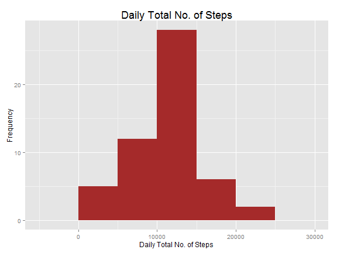
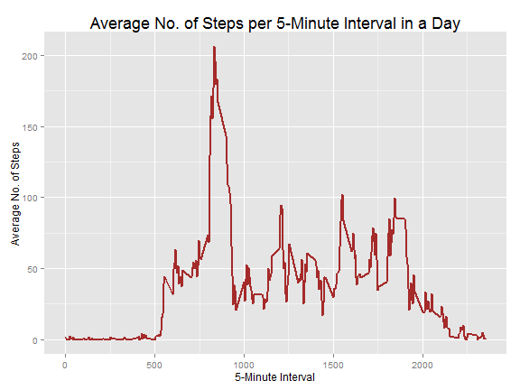
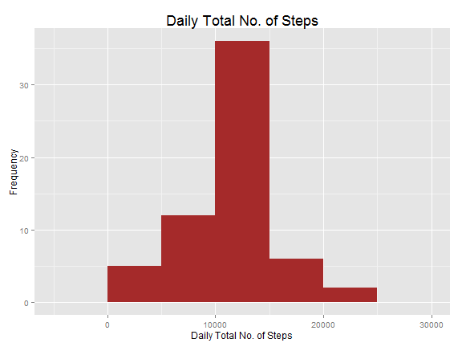
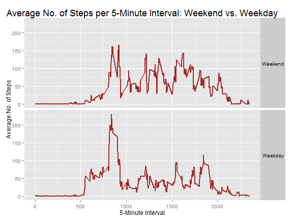

# Reproducible Research: Peer Assessment 1
<br>


## Loading and preprocessing the data
First of all, the following code downloads and pre-prosesses the Personal Activity data:

```r
# Set data source URL and file paths
url <- "https://github.com/luongthevinh/RepData_PeerAssessment1/raw/master/activity.zip"
fileName <- "activity.csv"

# Download data
setInternet2(TRUE)
tempFile <- tempfile()
download.file(url, tempFile)
dat <- read.csv(unzip(tempFile, fileName))
dat$date <- as.Date(dat$date)

# Load the 'reshape2' and 'ggplot2' packages for reshaping and plotting data
library(reshape2)
library(ggplot2)
```

<br>


## What are the mean and median total numbers of steps taken per day?
Let's now look at a histogram of the subject's total number of steps taken each day during the months of October-November 2012:

```r
# Melt data
dat_melt <- melt(dat, id = c("date", "interval"), na.rm = TRUE)

# Plot histogram of Daily Total No. of Steps
dailyNumSteps <- dcast(dat_melt, date ~ variable, sum)
ggplot(dailyNumSteps, aes(steps)) + geom_histogram(binwidth = 5 * 1000, fill = "brown") + 
    theme(plot.title = element_text(size = rel(1.5))) + ggtitle("Daily Total No. of Steps") + 
    xlab("Daily Total No. of Steps") + ylab("Frequency")
```

 

```r
# Compute mean and median of Daily Total No. of Steps
dailyNumSteps_mean <- mean(dailyNumSteps$steps)
dailyNumSteps_med <- median(dailyNumSteps$steps)
```

During the concerned time period, the subject's average and median numbers of steps taken daily were **10,766** and **10,765**, respectively.
<br><br><br>


## What is the average daily activity pattern?
Next, let's chart out the subject's average activity pattern during a day, broken into 5-minute time intervals:

```r
# Plot daily activity pattern
dailyNumSteps_avgByInterval <- dcast(dat_melt, interval ~ variable, mean)
ggplot(dailyNumSteps_avgByInterval, aes(interval, steps)) + geom_line(size = 1, 
    colour = "brown") + theme(plot.title = element_text(size = rel(1.5))) + 
    ggtitle("Average No. of Steps per 5-Minute Interval in a Day") + xlab("5-Minute Interval") + 
    ylab("Average No. of Steps")
```

 

```r
# Identify time interval with max activity level
maxActivityInterval <- dailyNumSteps_avgByInterval$interval[which.max(dailyNumSteps_avgByInterval$steps)]
maxActivityInterval <- formatC(maxActivityInterval, width = 4, flag = "0")
maxActivityInterval <- paste(substr(maxActivityInterval, 1, 2), substr(maxActivityInterval, 
    3, 4), sep = ":")
```

During such a typical day, the peak activity level occurs at around **08:35**.
<br><br><br>


## Imputing missing values

```r
# Identify rows with missing data
datWithNAs_melt <- melt(dat, id = c("date", "interval"))
naRowNums <- is.na(datWithNAs_melt$value)
```

The original data source contains **2,304** missing values. In order to reduce the potential bias caused by such missing values, we impute each missing data point with the average number of steps in the same time interval across days in the observed time period.

```r
# Impute missing data
datImputed_melt <- datWithNAs_melt
datImputed_melt$value[naRowNums] <- dailyNumSteps_avgByInterval$steps[match(datImputed_melt$interval[naRowNums], 
    dailyNumSteps_avgByInterval$interval)]
```

Let's now re-look at the histogram of the subject's total number of steps taken each day, with the missing data points imputed by the above process:

```r
# Plot histogram of Daily Total No. of Steps
dailyNumSteps <- dcast(datImputed_melt, date ~ variable, sum)
ggplot(dailyNumSteps, aes(steps)) + geom_histogram(binwidth = 5 * 1000, fill = "brown") + 
    theme(plot.title = element_text(size = rel(1.5))) + ggtitle("Daily Total No. of Steps") + 
    xlab("Daily Total No. of Steps") + ylab("Frequency")
```

 

```r
# Compute mean and median of Daily Total No. of Steps
dailyNumSteps_mean <- mean(dailyNumSteps$steps)
dailyNumSteps_med <- median(dailyNumSteps$steps)
```

With the imputed data set, the subject's average and median number of steps taken daily were **10,766** and **10,766**, respectively. These values are very close to those computed for case with missing data. This is likely to be because of our choosing the "averaging" imputing method.
<br><br><br>


## Are there differences in activity patterns between weekdays and weekends?
Let's now assess if the daily activity pattern differs between working weekdays and weekends.

```r
# Plot daily activity patterns during weekends vs. weekdays
datImputed_melt$wkday_or_wkend <- as.factor((as.POSIXlt(datImputed_melt$date)$wday %in% 
    1:5) + 1)
levels(datImputed_melt$wkday_or_wkend) <- c("Weekend", "Weekday")
dailyNumSteps_avgByInterval <- dcast(datImputed_melt, wkday_or_wkend + interval ~ 
    variable, mean)
ggplot(dailyNumSteps_avgByInterval, aes(interval, steps)) + geom_line(size = 1, 
    colour = "brown") + facet_grid(wkday_or_wkend ~ .) + theme(plot.title = element_text(size = rel(1.5)), 
    strip.text.y = element_text(angle = 0)) + ggtitle("Average No. of Steps per 5-Minute Interval: Weekend vs. Weekday") + 
    xlab("5-Minute Interval") + ylab("Average No. of Steps")
```

 

This comparison hows that the subject was much more active during weekends than he/she was during weekdays. This is perhaps because the subject is a white-collar worker and spent most of his/her late-morning and afternoon time sitting down at a stationary workstation.
